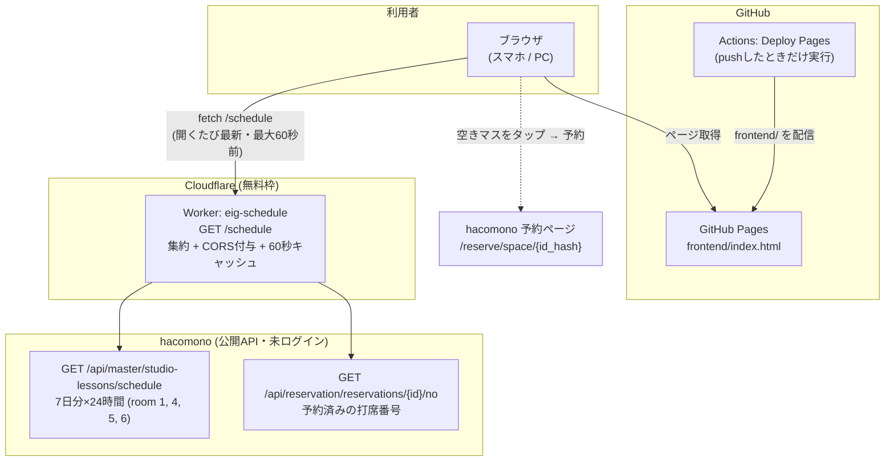

# E.I.G 予約状況ビューア

長岡 Enjoy Indoor Golf (E.I.G) の hacomono 予約状況を、見やすい独自UIでリアルタイム表示する。

- 公開サイト: https://takanarishimbo.github.io/enjoyindoorgolf/
- 予約そのものは hacomono 側で行う（空きマスのタップで公式予約ページへ遷移）

## システム構成



ポイント:

- **常設バックエンドなし**。Worker はステートレスな集約・中継のみ（hacomono 以外へは中継しない）
- ブラウザから hacomono を直接 fetch できない（CORS 制約、後述）ため、Worker が取得役を担う
- Worker のエッジキャッシュ 60 秒により、閲覧者が何人いても hacomono への負荷は最大 1 分に 1 回分
- GitHub Actions は **push 時の Pages デプロイのみ**。定期実行（cron）は無い

## ディレクトリ構成

```
├── README.md
├── frontend/            # GitHub Pages で配信される静的サイト
│   ├── index.html       # ビューア本体 (依存なしの素のHTML/CSS/JS)
│   └── schedule.json    # Worker障害時のフォールバック (静的スナップショット)
├── backend/             # Cloudflare Worker
│   ├── worker.js        # 集約API本体
│   ├── wrangler.toml
│   └── scripts/
│       └── fetch_schedule.py   # フォールバック schedule.json のローカル生成 (任意)
└── .github/workflows/
    └── deploy-pages.yml # push時に frontend/ を Pages へデプロイ
```

## API調査結果（2026-08-24）

### 公開スケジュールAPI

```
GET https://enjoyindoorgolf.hacomono.jp/api/master/studio-lessons/schedule?query={URLエンコードしたJSON}
query = {"page":1,"is_all":true,"studio_id":1,"studio_room_id":1}
```

- **認証・Cookie・CSRFトークン一切不要**（未ログインで取得可能）
- 注意: `User-Agent` ヘッダが無いと `data:{}` の空応答になる
- 1回の呼び出しで **今日から7日分 × 24時間 = 168スロット** が返る
- レスポンス: `data.studio_lessons.items[]` に各1時間枠
  - `date`, `start_at`, `end_at` — 枠の日時（JST）
  - `reservation_count` — 予約数（0〜3）
  - `is_reservable` — 受付時間内か（満席でも true になるので空き判定には使わない）
  - `id_hash` — 予約画面URL `/reserve/space/{id_hash}` に使用

### 予約済み打席番号API（重要）

```
GET https://enjoyindoorgolf.hacomono.jp/api/reservation/reservations/{studio_lesson_id}/no
→ {"data":{"nos":[1,2]}}
```

- **未ログインで、その枠の予約済み打席番号がそのまま取れる**（数値の lesson id を使う。id_hash では空が返る）
- `/reserve/space/{id_hash}` ページの座席マップはこのデータでSSRされている

### 打席別room（room 4/5/6）

`/reserve/schedule/1/4〜6` は「1番/2番/3番打席（6/1~予約開始予定）」のタブで、
`studio_room_id: 4/5/6` で打席単位（各定員1）の予約状況が取れる。
ただし2026-08-24時点で実予約はすべて room 1（3席まとめ）に入っており room 4〜6 は全枠ゼロ。
Worker は両方式をマージするので、どちらで予約されても検知できる。

### CORS

- `Access-Control-Allow-Origin` は hacomono 自身のAPIホスト固定（Origin反射もJSONPも無し）
- よって **ブラウザから直接 fetch は不可** → Cloudflare Worker で集約・CORS付与する方式を採用

## セットアップ

### backend (Cloudflare Worker)

```
cd backend
npx wrangler login      # 初回のみ
npx wrangler deploy     # → https://eig-schedule.<subdomain>.workers.dev
```

デプロイ後、`frontend/index.html` 冒頭の `WORKER_URL` を実URLに合わせる。
ローカル検証は `npx wrangler dev` → `http://localhost:8787/schedule`。

### frontend (GitHub Pages)

main へ push すると `deploy-pages.yml` が `frontend/` をそのまま公開する。
リポジトリ設定は Settings → Pages → Source: **GitHub Actions**。

ローカル確認:

```
python3 -m http.server -d frontend 8000
# Worker URLの一時上書き: http://localhost:8000/?worker=http://localhost:8787/schedule
```
