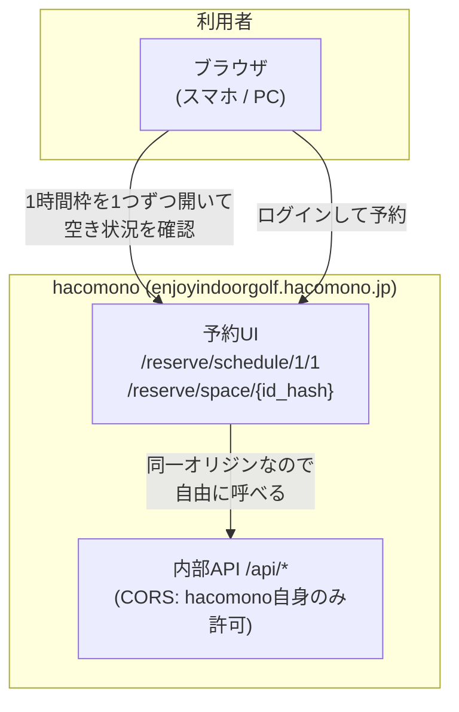
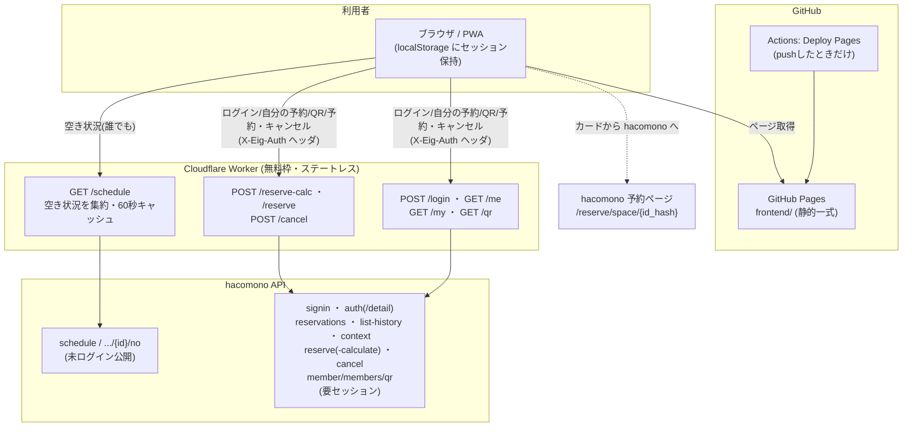

# オレオレ E.I.G

長岡 Enjoy Indoor Golf (E.I.G) の hacomono 予約を、自分用に使いやすくした非公式Webアプリ（PWA）。

- 公開サイト: https://takanarishimbo.github.io/enjoyindoorgolf/
- 空き状況の閲覧は誰でも。ログインすると**このアプリから予約・キャンセル**まで可能（プラン/チケット）。決済や本人確認は hacomono 側。

## できること

- **週間タイムテーブル（予約用）** — 3打席×24時間×7日の空きを一覧。空きマスのタップで hacomono の予約画面へ。
  - スマホは画面幅ちょうど**3日表示**、左右スワイプで日付単位にスナップ。PCは横幅に応じて**7日**表示。
  - 上部の期間バーに1週間分の日付を並べ、**今表示中の3日だけカラー**。
  - 土=青 / 日=赤、6時間ごとの区切り、過去は減光など誤読を防ぐ配色。
- **コマをタップ → 予約カード** — ログイン中は空きマス（および予約済み・満席マス）をタップするとカードが開く。
  - **打席を選択**（3打席表示、空きでない打席はグレーで選択不可）。
  - **プラン / チケット予約に対応**。チケット選択時は保有チケット一覧（残数つき）から選ぶ。
  - **プランの同時予約上限**（本家「同時予約可能数」）や受付時間などを判定し、不可なら理由を表示してボタンを無効化。
  - 予約・キャンセルは**カード内ページ遷移**で確認（1:内容 → 2:確認 → 3:完了）。完了ページは**カウントダウン後に自動で戻り**、最新状態で再表示。
  - 予約済みマスのカードから**キャンセル**（二段確認）、**Google カレンダーに追加**も可能。
- **予約情報** — ログイン中は**自分の未来の予約**を新しい順に表示。行タップで同じカードを開く。
- **ログイン（任意・自分用）** — hacomono のID/パスワードでログインすると以下が有効化：
  - 会員バーに**氏名・プラン名・メール**を表示。
  - 自分の予約を週間テーブルに**オレンジ枠＋該当打席オレンジ**で重ね表示。
  - **実績ダッシュボード**（総利用 / 直近30日 / 直近7日 / 連続利用日数）＋ **GitHub 草風ヒートマップ**（1日最大2回＝3段階、日タップで時間一覧、約1年分）。
  - **入場QR**（本家と同じ会員QR画像）を右下フローターボタンからいつでも表示。有効期限（約30分）に合わせて残り時間表示・自動更新。
- **PWA** — ホーム画面に追加してアプリとして起動。オフラインでもシェルが開く。
- 落ち着いたホワイトテーマ、行/列タップで交点をハイライトする補助機能つき。

## システム構成

### 従来: hacomono をそのまま使う場合

利用者は hacomono の予約UI（Nuxt製のWebアプリ）を開き、UIが同一オリジンのAPIを呼んで表示する。
空き状況の確認も予約も、すべて hacomono の画面の中で完結する。



課題: 3打席×24時間の空きを一覧できず、枠を1つずつ開かないと状況が分からない。

### 本プロジェクト: 独自UI + 集約Worker を横に足す

hacomono には手を入れず、公開API/セッションAPIを Cloudflare Worker 経由で読み取り利用する。
予約は従来どおり hacomono へ。**常設バックエンドは持たず**、Worker はステートレスな集約・中継のみ。



ポイント:

- ブラウザから hacomono を直接 fetch できない（CORS 制約、後述）ため、Worker が取得役を担う。
- `/schedule` はエッジ60秒キャッシュ。閲覧者が何人いても hacomono への負荷は最大1分に1回分。
- ログイン系（`/login` `/my` `/qr`）は個人情報のため**キャッシュせず**中継のみ。認証情報は利用者の localStorage だけに保持。
- GitHub Actions は **push 時の Pages デプロイのみ**。定期実行（cron）は無い。

## ディレクトリ構成

```
├── README.md
├── frontend/                  # GitHub Pages で配信される静的サイト
│   ├── index.html             # アプリ本体
│   ├── manifest.webmanifest   # PWA マニフェスト
│   ├── sw.js                  # Service Worker (アプリシェルのみキャッシュ)
│   ├── favicon.svg / favicon-16,32.png / icon-180,192,512(,-maskable).png
│   └── schedule.json          # Worker障害時のフォールバック (静的スナップショット)
├── backend/                   # Cloudflare Worker
│   ├── worker.js              # /schedule /login /me /my /qr /reserve-calc /reserve /cancel
│   ├── wrangler.toml
│   └── scripts/
│       └── fetch_schedule.py  # フォールバック schedule.json のローカル生成 (任意)
└── .github/workflows/
    └── deploy-pages.yml       # push時に frontend/ を Pages へデプロイ
```

## Worker エンドポイント

| メソッド/パス | 認証 | 内容 |
| --- | --- | --- |
| `GET /schedule` | 不要 | 3打席×24時間×7日の空き状況を集約。`?refresh=1` でキャッシュ無視。60秒エッジキャッシュ。 |
| `POST /login` | — | `{id,password}` を signin へ中継し、**発行セッションのみ**返す。パスワードは保存・ログ・キャッシュしない。 |
| `GET /me` | `X-Eig-Auth` | 会員情報（氏名・メール・プラン名 = `member_plan.plan.name`）。 |
| `GET /my` | `X-Eig-Auth` | 自分の予約（未来＝`reservations` + 過去＝`list-history`）。予約ID・キャンセル期限も付与。 |
| `POST /reserve-calc` | `X-Eig-Auth` | 予約のドライラン。id_hash→lesson_id→context→`reserve-calculate`。プラン/チケット両対応。同時予約上限や使えるチケット一覧も返す。 |
| `POST /reserve` | `X-Eig-Auth` | 本予約（プラン/チケット）。`ticket_id`指定でチケット予約。 |
| `POST /cancel` | `X-Eig-Auth` | 予約キャンセル（`reservation_ids`）。 |
| `GET /qr` | `X-Eig-Auth` | 本家と同じ会員QR画像 `member/members/qr`(署名済みJWT `{id,exp}` を焼いたPNG)を取得し data URL で返す。有効期限≒30分・予約に関係なく常時。 |

## API調査結果（2026-08-24）

### 公開スケジュールAPI

```
GET https://enjoyindoorgolf.hacomono.jp/api/master/studio-lessons/schedule?query={URLエンコードしたJSON}
query = {"page":1,"is_all":true,"studio_id":1,"studio_room_id":1}
```

- **認証・Cookie・CSRFトークン一切不要**（未ログインで取得可能）。`User-Agent` が無いと空応答になる。
- 1回で **今日から7日分 × 24時間 = 168スロット**。`data.studio_lessons.items[]` に各枠。
  - `date` / `start_at` / `end_at`（JST）、`reservation_count`（0〜3）、
    `is_reservable`（受付時間内か。満席でも true になり得るので空き判定には使わない）、
    `id_hash`（予約画面URL `/reserve/space/{id_hash}` に使用）。

### 予約済み打席番号API

```
GET /api/reservation/reservations/{studio_lesson_id}/no  →  {"data":{"nos":[1,2]}}
```

- **未ログインで予約済み打席番号が取れる**（数値の lesson id を使う。id_hash では空）。
- `/reserve/space/{id_hash}` の座席マップはこのデータで SSR されている。

### 打席別room（room 4/5/6）

`studio_room_id: 4/5/6` で「1〜3番打席」タブの打席単位状況も取れるが、2026-08-24時点で実予約はすべて
room 1（3席まとめ）。**本システムは room 1 + `/no` のみ参照**（移行時はマージ処理復活、git履歴に実装あり）。

### ログイン系（要セッション）

- `POST system/auth/signin` — ヘッダ `X-Requested-With: XMLHttpRequest` 必須、payload `{mail_address|tel, password, ...}`。
  reCAPTCHA 不要。成功時 Set-Cookie でセッション発行（Cookieベース認証）。
- `GET system/auth` / `system/auth/detail` — 会員情報。氏名・メールは `data.member`、プラン名は `data.member_plan.plan.name`。
- `GET reservation/reservations`（未来）/ `reservation/reservations/list-history`（過去）— 自分の予約。予約IDは `id`、キャンセル期限は `cancelable_at`。
- 予約確定は共通で `POST reservation/reservations/reserve`（検証は `reserve-calculate`）。payload の `reservation_type` が `"plan"`/`"ticket"` の分岐で、チケット時は `ticket_id`＋`contract_group_no`（context の `ticket_cases[]` から、`num>0` の保有チケットのみ）。
  - **同時予約上限**はプラン専用フィールド `max_concurrency_reservable_num_by_plan` / `concurrency_reserved_num_by_plan`（汎用の `*_num` は別物）。
- `PUT reservation/reservations/cancel` — キャンセル。payload `{reservation_ids:[id]}`。
- `GET member/members/qr` — **入場QRの本体**（本家 `MemberQR` コンポーネントが使用）。署名済みJWT `{id, exp}` を焼いた **PNG画像を直接返す**。有効期限は `member_token_expire_minutes`(既定30分)、予約に関係なく常時取得可。未ログイン時は空PNG。
  - 参考: `system/tokens/temporary`(payload `{user_id,type,exp}`)や `accesses.qr_data` は入場QRには使われていなかった。

### CORS

- `Access-Control-Allow-Origin` は hacomono 自身のAPIホスト固定（Origin反射もJSONPも無し）。
- よって **ブラウザから直接 fetch は不可** → Cloudflare Worker で集約・CORS付与する方式を採用。

## セキュリティ / 注意

- 公開の空き状況表示は未ログインの公開APIのみ使用。
- ログイン機能は**自分用の非公式ツール**。パスワードは Worker を通過するだけで保存しない、セッションは利用者の
  ブラウザ localStorage のみに保持。セッション/パスワードはアカウント全権限を持つため共有端末では使わない。
  Worker は自分で用意・管理する前提（信頼できる中継者であること）。
- 予約・キャンセルは**実際に hacomono の予約を作成/取消する不可逆操作**。UIでは二段確認（内容→確認→完了のページ遷移）を挟む。利用は自己責任。

## セットアップ

### backend (Cloudflare Worker)

```
cd backend
npx wrangler login      # 初回のみ
npx wrangler deploy     # → https://eig-schedule.<subdomain>.workers.dev
```

デプロイ後、`frontend/index.html` 冒頭の `WORKER_URL` を実URLに合わせる。
ローカル検証は `npx wrangler dev` → `http://localhost:8787/schedule`。

### frontend (GitHub Pages)

main へ push すると `deploy-pages.yml` が `frontend/` を公開する。
リポジトリ設定は Settings → Pages → Source: **GitHub Actions**。

ローカル確認:

```
python3 -m http.server -d frontend 8000
# Worker URLの一時上書き: http://localhost:8000/?worker=http://localhost:8787/schedule
```
